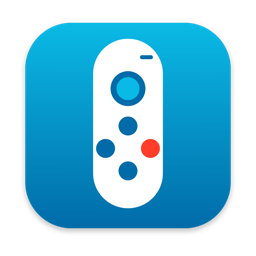

<div align="center">



# JoyClicker

**把 Switch 的 Joy-Con 变成 PPT 翻页笔（Mac / Windows）**

[](#下载)
[](#windows-版)
[](JoyClicker.swift)
[](#按键)
[](https://github.com/LeoLee0812/joy-clicker/releases/latest)
[](https://github.com/LeoLee0812/joy-clicker/actions)
[](LICENSE)

</div>

把蓝色左手柄竖着握，像拿遥控器一样用：十字键就是方向键，扳机翻到下一页，− 键短按黑屏、按住退出放映，按下摇杆从头开始放映。

Mac 版就一个 Swift 文件，没有任何依赖，常驻在菜单栏；Windows 版是一个 3 MB 的 exe，常驻在托盘。没连手柄的时候它们什么都不干。

## 下载

到 [Releases](https://github.com/LeoLee0812/joy-clicker/releases/latest) 下载：

| 系统 | 文件 | 怎么装 |
|---|---|---|
| macOS 13+（Apple 芯片和 Intel 都行） | `JoyClicker-版本号-macOS.dmg` | 打开 dmg，把 JoyClicker 拖进「应用程序」 |
| Windows 10 / 11（64 位） | `JoyClicker-版本号-Windows-x64.exe` | 免安装，双击就运行 |

两个包都没有花钱买签名证书，第一次打开会被系统拦一下：

- **Mac**：提示「无法验证开发者」时，去「系统设置 › 隐私与安全性」最下面点「仍要打开」。也可以在终端里运行 `xattr -dr com.apple.quarantine /Applications/JoyClicker.app`。打开后再按下面「安装」一节给辅助功能权限。
- **Windows**：SmartScreen 弹「Windows 已保护你的电脑」时，点「更多信息 › 仍要运行」。

## 按键

| 按键（竖握） | 作用 | 实际发给前台 App 的键 |
|---|---|---|
| 十字键 → ↓ | 下一页 | → / ↓ |
| 十字键 ← ↑ | 上一页 | ← / ↑ |
| ZL 扳机 | 下一页 | → |
| L 肩键 | 上一页 | ← |
| − 短按 | 黑屏，再按一下恢复 | B |
| − 按住 1 秒 | 退出放映（手柄震一下，表示可以松手了） | Esc |
| 按下摇杆 | 从头开始放映 | 看前台是什么软件，见下表 |
| SL / SR | 横握时的上一页 / 下一页 | ← / → |

红色右手柄也能用：X B Y A 按位置当 ↑ ↓ ← →，ZR 是下一页，R 是上一页，+ 和 − 一样。
截图键和 HOME 键没有映射，因为 macOS 的「游戏控制器」设置会拿它们截屏、打开启动台。

WPS、PowerPoint、Keynote、Google 幻灯片、预览（PDF）、reveal.js 这类网页幻灯片，放映时都用方向键翻页。不在放映的时候它们就是普通方向键，滚网页、翻 PDF 也能用。

「从头开始放映」会看前台是什么软件，发对应的快捷键：

| 前台软件 | 快捷键 |
|---|---|
| WPS、PowerPoint | ⇧⌘↩ |
| 浏览器里的 Google 幻灯片 | ⇧⌘↩ |
| Keynote | ⌥⌘P |
| 预览 | ⇧⌘F |
| 其他软件 | 不发键，手柄震两下，表示这里没法放映 |

## 小细节

- **手柄上亮几格灯，就是还剩几格电**。玩家指示灯拿来当电量格用，没电时第 1 格会闪。
- 手柄连上时会震两下，表示已经可以用了。
- 菜单栏图标是实心的表示手柄在线，空心表示没连上，变灰表示已暂停或者还没给权限。点开菜单可以看电量、暂停翻页、开关开机自启。
- 讲一页讲很久也不怕手柄睡着：最后一次按键后 30 分钟内，每 2 秒给手柄发一帧空震动保活。实测不保活也能连着 15 分钟以上，这只是多一层保险。要改时长就运行 `defaults write com.leo.joyclicker keepAliveMinutes -float 60`，设成 0 是关掉。
- 作者自己的眼动阅读器 Glint 也会直接读 Joy-Con。Glint 在前台时 JoyClicker 自动让开，Glint 在运行时 JoyClicker 不往手柄发任何指令。

## 安装

需要 macOS 13 或更新的系统，还要装好 Xcode 命令行工具（运行 `xcode-select --install`）。

```bash
git clone https://github.com/LeoLee0812/joy-clicker.git
cd joy-clicker
./build.sh --install   # 编译，装进 /Applications，然后启动。第一次启动会默认打开开机自启
```

第一次用之前要做两件事：

1. **配对手柄**：按住 Joy-Con 侧面滑轨上的小圆键（同步键），等指示灯来回跑，然后打开「系统设置 › 蓝牙」点连接。配对一次就够了，以后按手柄上任意键它就会自己连回来。
2. **打开辅助功能权限**：第一次启动会弹出「JoyClicker 想要控制这台电脑」，点「打开系统设置」，把 JoyClicker 的开关打开。没有这个权限就发不了按键。

> 如果钥匙串里有开发者证书，`build.sh` 会自动用它签名，以后重新编译也不用重新授权。没有证书就用 ad-hoc 签名，这种情况下每次重新编译都要去系统设置里重新打开一次开关。

## Windows 版

- 配对：按住 Joy-Con 侧面滑轨上的同步键，等指示灯来回跑，然后在「设置 › 蓝牙和其他设备 › 添加设备 › 蓝牙」里选 Joy-Con。
- 双击 exe 后，任务栏右下角托盘里会出现手柄图标。右键可以看电量、暂停翻页、开关开机自启、退出。第一次运行会默认打开开机自启。
- Windows 不需要另外授权。按键表和 Mac 版一样，只有「从头开始放映」不同：前台是 PowerPoint、WPS、LibreOffice 时发 F5，在浏览器里不发（浏览器里 F5 是刷新），手柄会震两下。
- 代码在 [`windows/`](windows) 目录，纯 Go，没有 cgo，在 Mac 上也能交叉编译。每次改动都会在 GitHub Actions 的 Windows 虚拟机上跑测试，包括真的往系统里注入按键、枚举 HID 设备、启动 exe 再正常退出。

## 原理

- 用 `IOHIDManager` 非独占地读手柄的蓝牙 HID 原始报告，没有用系统自带的 GameController 框架。那个框架会把单只 Joy-Con 当成横握的小手柄，左手柄干脆认不出来。
- 先发子命令 `0x03 0x30`，把手柄切到全量模式，每秒大约上报 60 帧。每帧第 3 到 5 字节是按键，第 2 字节的高 4 位是电量。手柄睡醒以后会回到简单模式，所以有个看门狗：3 秒没收到全量报告就重新切一次。
- 只在按键刚按下的那一下发键，按住不会连发。键盘事件用 `CGEvent` 发给前台 App。发组合键时会先真的按下修饰键再松开，因为 WPS 这种 Qt 程序只认系统里实际的修饰键状态。
- 发给手柄的指令（子命令、震动、指示灯）每 15 毫秒最多发一包，子命令之间至少隔 60 毫秒，发太快手柄会丢包。
- 两只手柄都在线时，CPU 占用约 0.6%，内存约 28 MB。

## 自己编译

```bash
./build.sh --install   # Mac：编译、装进 /Applications、启动
./release.sh           # 打发布包到 dist/：Mac 通用 dmg + Windows exe（Windows 部分要装 Go）
```

## 调试

```bash
build/JoyClicker.app/Contents/MacOS/JoyClicker --probe      # 在终端里看按键事件，不发键，每分钟报一次电量和帧率
build/JoyClicker.app/Contents/MacOS/JoyClicker --selftest   # 不连手柄，检查报告解析和按键映射对不对
/usr/bin/log stream --level debug --predicate 'subsystem == "com.leo.joyclicker"'  # 看连接、断开，以及每次按键有没有发出去
```

> 要写全路径 `/usr/bin/log`：zsh 自带一个同名的 `log` 命令，直接敲 `log stream` 会报 too many arguments。

## 致谢

- Joy-Con 协议：[dekuNukem/Nintendo_Switch_Reverse_Engineering](https://github.com/dekuNukem/Nintendo_Switch_Reverse_Engineering)
- HD 震动编码：[tomayac/joy-con-webhid](https://github.com/tomayac/joy-con-webhid)

## License

[MIT](LICENSE)
